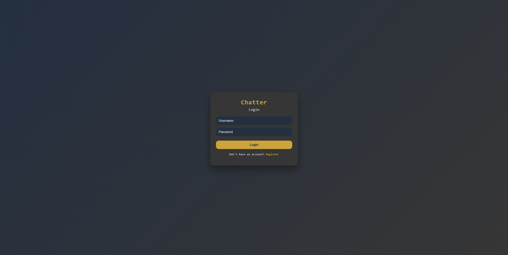
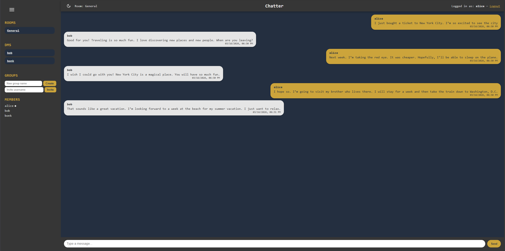

# flask-chatter

A WhatsApp-style real-time chat app built with Flask and SocketIO.




## Features

- Real-time messaging via WebSockets (Flask-SocketIO)
- Public rooms and private direct messages (DMs)
- Group chat with owner/member roles and invite system
- User registration and login with hashed passwords
- Typing indicators and online/offline presence
- Persistent message history (SQLite)
- Light/dark mode toggle

## Tech Stack

- **Backend:** Python, Flask, Flask-SocketIO, Flask-SQLAlchemy
- **Database:** SQLite
- **Frontend:** Vanilla JS, HTML/CSS
- **Auth:** Session-based with Werkzeug password hashing

## Getting Started

### 1. Clone the repo

```bash
git clone https://github.com/mrpoes/flask-chatter
cd flask-chatter
```

### 2. Create a virtual environment

```bash
python -m venv venv
venv\Scripts\activate      # Windows
source venv/bin/activate   # macOS/Linux
```

### 3. Install dependencies

```bash
pip install -r requirements.txt
```

### 4. Configure environment variables

Create a `.env` file in the root directory:

```env
SECRETKEY=your_secret_key_here
U1NAME=user1
U1PASS=password1
U2NAME=user2
U2PASS=password2
```

`U1NAME`/`U2NAME` and their passwords are demo users seeded on first run.

### 5. Run the app

```bash
python server.py
```

Visit `http://localhost:5000` in your browser.

## Project Structure

```
flask-chatter/
├── server.py          # Main app, routes, and socket handlers
├── models.py          # SQLAlchemy models (User, Room, Message)
├── helper.py          # login_required decorator
├── requirements.txt
├── static/
│   ├── app.js
│   ├── styles.css
│   └── ...
└── templates/
    ├── index.html
    ├── login.html
    ├── register.html
    └── no.html
```

## License

MIT
